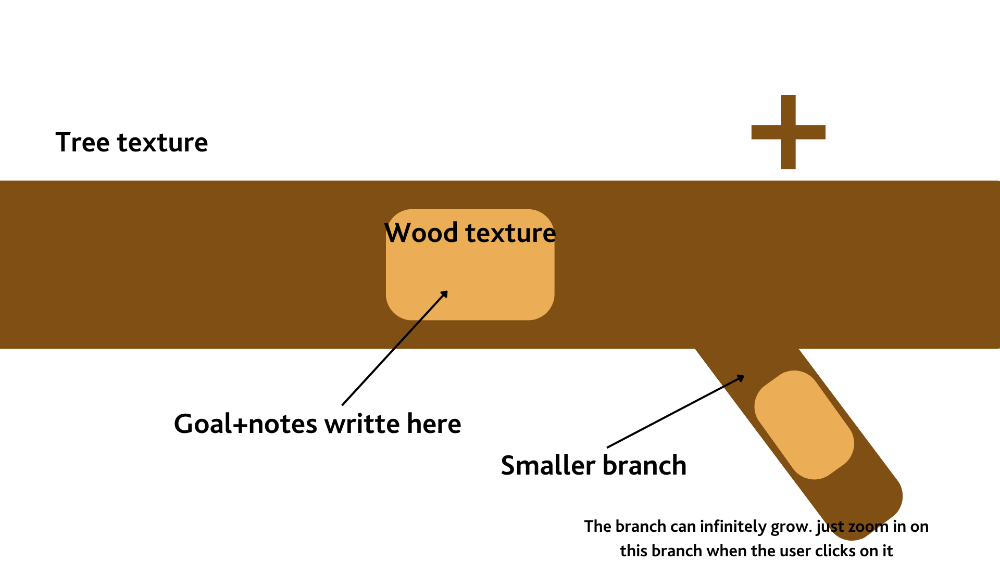

# Branches

Branches is a motivational planning app for turning a large goal into smaller, connected tasks. The core idea is simple: a goal should not feel like a flat checklist. It should grow like a living structure, where every task can branch into smaller tasks until the next step feels clear.



## What It Does

Branches starts with a main-goals page. Each main goal can have its own icon, deadline, notes, and task tree. Opening a goal brings the user into a focused workspace where the same task structure can be viewed in three different ways.

- **Branches**: a branch-inspired visual workspace for growing tasks from the current goal
- **Mindmap**: a cleaner node map for seeing task relationships
- **Plan Board**: a row-based planning view for scanning tasks one path at a time

All three views use the same underlying data. If a user adds, edits, completes, removes, restores, or moves a task in one view, the other views update automatically.

## Features

- Create, edit, select, and remove main goals
- Choose an icon and deadline for each main goal
- Add smaller tasks under any task
- Edit task name, notes, priority number, and due date
- Move a task under another task, including all of its smaller tasks
- Mark tasks as done with confirmation
- Restore completed tasks back into progress
- Remove completed tasks into a collection
- Restore removed tasks from the collection
- Undo the most recent structural or status action
- Track task progress with completed/total fractions
- Use in-app confirmation dialogs instead of browser alerts
- See hover hints when an action is unavailable

## Tech Stack

Branches is a static frontend prototype built with:

- HTML
- CSS
- Vanilla JavaScript
- `localStorage` for browser-side persistence

There is no backend, account system, database, or build pipeline yet.

## Run Locally

From the project folder:

```bash
npm start
```

Then open:

```text
http://localhost:5173
```

You can also serve the folder with Python:

```bash
python3 -m http.server 5173
```

## Check The App

Run the JavaScript syntax check:

```bash
npm run check
```

## Project Structure

```text
.
├── index.html                    # App entry point and markup templates
├── src/
│   ├── app.js                    # State, rendering, interactions, and localStorage
│   └── styles.css                # Layout, views, jungle theme, and responsive styling
├── assets/                       # Backgrounds and texture assets
├── docs/
│   ├── branches-prd.pdf          # Product requirements document
│   └── screenshots/              # Design previews and screenshots
├── package.json                  # Local scripts
├── AGENTS.md                     # Guidance for AI coding agents
└── README.md
```

## Data Storage

Task data is stored locally in the user's browser with `localStorage`. This is useful for a prototype, but it means data is tied to the current browser and device.

Future production versions could add:

- User accounts
- Cloud sync
- Export/import
- Collaboration
- Notifications for deadlines

## Status

Branches is currently a functional frontend prototype. The main planning flow is complete enough for local testing and GitHub sharing, with future work focused on persistence, authentication, deployment, and more polished visual rendering.
